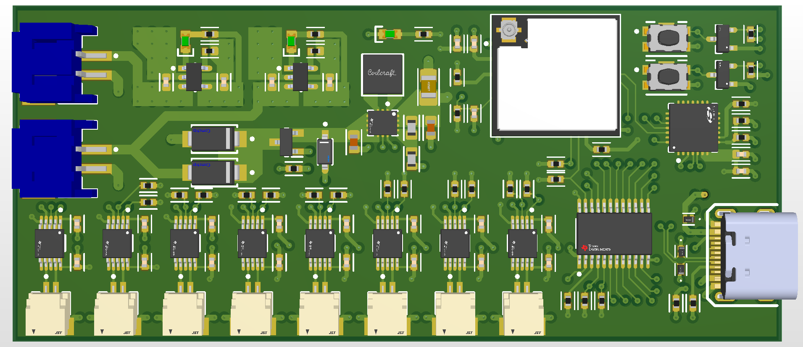
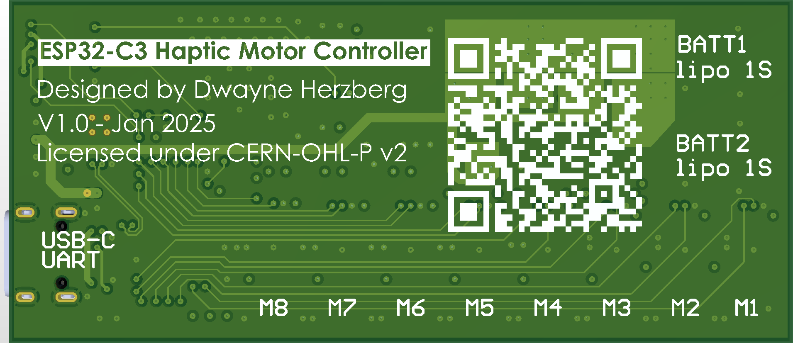

# ESP32-C3 Haptic Motor Controller

The **ESP32-C3 Haptic Motor Controller** is a standalone board designed to drive multiple haptic motors, based on the ESP32-C3-MINI-1U module.  
It features a **DRV2605L** haptic driver for each motor. The board is powered by two parallel LiPo batteries.

> ⚠️ Warning: This project has not been tested and will not be tested. It is a concept prototype developed for a student project only. Use it at your own risk.

The PCB is a 4-layer board following the **JLC04161H-3313** stackup:
- **Outer layers**: signals.
- **Inner layers**: ground (GND) and 3.3 V power.

📏 Board dimensions: **80 mm x 35 mm**.

Here is a 3D model preview of the PCB layout:

## Overview

- **ESP32-C3-MINI-1U** with Wi-Fi and Bluetooth LE
- **DRV2605L Haptic Drivers** (one per motor)
- **I²C Multiplexer TCA9548A**
- **Autonomous power** with two parallel LiPo batteries
- **TPS630250 Buck-Boost Converter** for stable 3.3 V
- **Simplified USB-C connector** for programming and charging
- **Independent battery chargers** for each battery
- **control buttons** (reset and boot)

## Project Contents

- **Altium Source Files** – Schematic and PCB Layout
- **Symbol & Footprint Libraries** – Custom libraries
- **Manufacturing Files** – Gerber files for PCB production
- **Assembly Files** – BOM and Pick & Place files

## License

This project is licensed under the [CERN Open Hardware Licence Version 2 – Permissive (CERN-OHL-P v2)](https://cern-ohl.web.cern.ch/).

See the `LICENSE.txt` file for full details.

---

**Dwayne Herzberg**  
Email: [dwayneherzberg@gmail.com](mailto:dwayneherzberg@gmail.com)